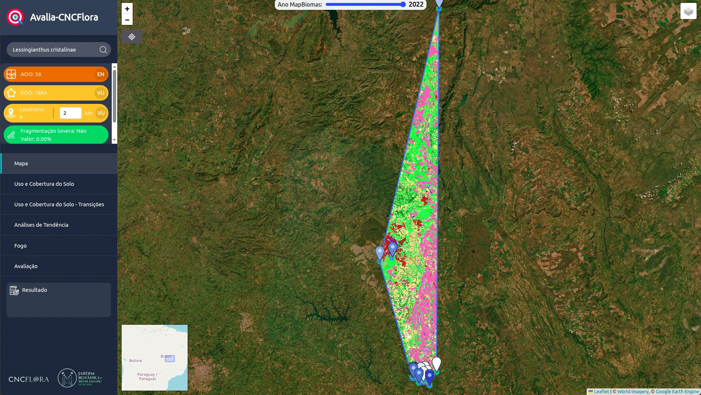

# cv-graph

Interface interativa, estilo Obsidian, para visualizar o **grafo curricular** de
Lucas Sá Barreto Jordão — um grafo JSON-LD com 1000+ nós (pessoas, projetos,
publicações, avaliações de espécies, tecnologias, competências e suas relações).

Renderização **3D por padrão** (3d-force-graph) com alternância para **2D**
(force-graph), _hover_ que destaca o nó e seus vizinhos enquanto esmaece o
resto, _clique_ que abre um painel de detalhe com navegação pelas conexões,
busca fuzzy e filtros por categoria.



---

## Como funciona

Este repositório é **somente a interface**. Os dados vêm de
[`Curriculum-vitae-CV-json`](../Curriculum-vitae-CV-json), onde o script
`semantics/scripts/export_graph.py` deriva `nodes`/`edges` a partir do grafo
canônico `cv.jsonld` e os grava aqui em `public/data/graph.json`.

A interface **não conhece JSON-LD nem ontologia** — consome apenas o
`graph.json` já limpo:

```jsonc
{
  "meta": { "base": "...", "person": "...", "stats": { "nodes": 1064, "edges": 3786 } },
  "nodes": [{ "id": "...", "label": "...", "category": "person", "degree": 51, ... }],
  "edges": [{ "source": "...", "target": "...", "label": "skill", "kind": "skill" }]
}
```

A divisão mantém a lógica de grafo no repositório-fonte (junto do canonical
source) e a interface livre dessa complexidade.

---

## Atualizar os dados

No repositório-fonte (`Curriculum-vitae-CV-json`):

```bash
npm run export:graph
```

Isso regenera `cv-graph/public/data/graph.json` e copia as mídias referenciadas.
O export é **idempotente** — rodar de novo sem mudar o grafo produz bytes
idênticos. Para a cadeia completa (enriquecer → validar → projetar → exportar):

```bash
npm run publish
```

---

## Rodar a interface

```bash
npm install
npm run dev      # http://localhost:5173
npm run build    # gera dist/ estático publicável
npm run preview  # serve o build
```

> Se a interface abrir sem o grafo, rode `npm run export:graph` no
> repositório-fonte primeiro para gerar `public/data/graph.json`.

---

## Interações

| Ação | Efeito |
| --- | --- |
| **Hover num nó** | destaca o nó + seus vizinhos e arestas incidentes; esmaece o resto |
| **Clique num nó** | abre o painel de detalhe (à direita) e foca a câmera |
| **Painel de detalhe** | mostra tipo, datas, descrição, links externos (URL/DOI) e a lista de conexões — cada uma clicável e navegável |
| **Busca** (canto superior) | fuzzy sobre rótulo + descrição; `Enter` ou clique voa até o nó. Atalho `/` |
| **Filtros** (esquerda) | mostra/oculta categorias inteiras — útil para a nuvem de 588 avaliações de espécies |
| **3D / 2D** (embaixo) | alterna o motor de renderização |
| **Rótulos** | mostra/oculta os rótulos dos nós |
| Arrastar / scroll / rotação (3D) | navegação livre |

---

## Arquitetura

```
src/
├── types.ts                 formas GraphNode/GraphEdge/GraphData
├── store.ts                 estado global (zustand): seleção, hover, filtros, modo
├── lib/
│   ├── loadGraph.ts         fetch /data/graph.json
│   ├── categories.ts        paleta + metadados por categoria
│   ├── neighbors.ts         adjacência (id → vizinhos) + escala de tamanho
│   ├── highlight.ts         cor/opacidade conforme o foco (hover Obsidian)
│   └── useGraphData.ts      subgrafo filtrado + highlight (compartilhado 3D/2D)
└── components/
    ├── GraphCanvas.tsx      comuta 3D ⇄ 2D
    ├── Graph3D.tsx          3d-force-graph (Three.js)
    ├── Graph2D.tsx          force-graph (canvas 2D)
    ├── DetailPanel.tsx      detalhe do nó + conexões navegáveis
    ├── SearchBar.tsx        busca fuzzy (Fuse.js)
    ├── FilterBar.tsx        chips de categoria com contagem
    ├── Header.tsx           título + contadores ao vivo
    ├── Controls.tsx         toggle 2D/3D + rótulos
    └── Legend.tsx           legenda de cores
```

O ponto-chave da consistência: ambos os motores (3D e 2D) consomem o mesmo
`usePreparedGraph()`, então _hover_, _clique_ e _filtros_ reagem de forma
idêntica nos dois modos.

---

## Stack

- **Vite + React + TypeScript**
- **3d-force-graph** / **force-graph** (vasturiano) — renderização 3D e 2D
- **zustand** — estado
- **framer-motion** — animações dos painéis
- **fuse.js** — busca fuzzy
- **tailwindcss** — estilos (tema escuro, glassmorphism)

## Licença

CC-BY-4.0 (os dados seguem o currículo-fonte).
